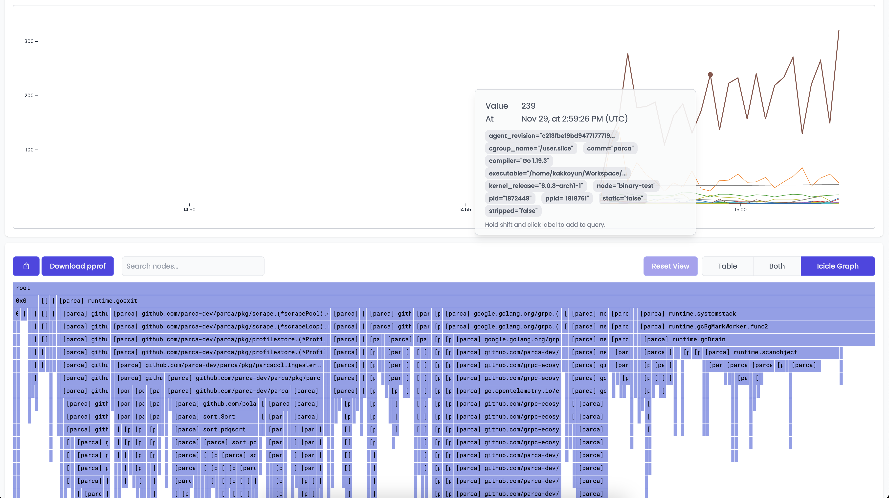

# Parca Agent from Binary

import WithVersions from '@site/src/components/WithVersions';
import CodeBlock from '@theme/CodeBlock';
import BrowserWindow from '@site/src/components/BrowserWindow';

You can download the latest agent binary release for your architecture from our [releases page](https://github.com/parca-dev/parca-agent/releases).
<WithVersions language="bash">
  { versions =>
    <CodeBlock className="language-bash">
      curl -sL https://github.com/parca-dev/parca-agent/releases/download/{versions.agent}/parca-agent_{versions.agent}_`uname -s`_`uname -m`.tar.gz | tar xvfz ./parca-agent
    </CodeBlock>
  }
</WithVersions>

We also produce Docker images that can be pulled:
<WithVersions language="bash">
  { versions =>
    <CodeBlock className="language-bash">
      docker pull github.com/parca-dev/parca-agent:{versions.agent}
    </CodeBlock>
  }
</WithVersions>

To start Parca Agent, run the following command with the flag:
```shell
sudo parca-agent --http-address=":7072" --node=systemd-test --systemd-units=docker.service --log-level=debug --kubernetes=false --store-address=localhost:7070 --insecure
```

:::info

The Agent needs to run as privileged user to load necessary eBPF programs to Kernel.

:::

The command above targets the Parca server that we have previously run. And it uses the `systemd` service discovery to find the cgroups that has been running on your system.

:::caution

Note that Parca Agent's `systemd` service discovery currently only support cgroup v1. Make sure you uses cgroup v1 if you have problems discovering running services.

:::

You should see with some log lines:
```shell
ts=2021-09-27T11:24:46.142174407Z caller=main.go:81 msg=starting... node=systemd-test store=localhost:7070
level=debug ts=2021-09-27T11:24:46.142193096Z caller=main.go:82 msg="parca-agent initialized" version= commit= date= builtBy= config="unsupported value type"
level=debug ts=2021-09-27T11:24:46.142326491Z caller=main.go:276 msg="starting systemd manager"
level=debug ts=2021-09-27T11:24:47.143212813Z caller=systemdmanager.go:131 msg="running systemd manager" units=1
level=debug ts=2021-09-27T11:24:47.143340129Z caller=systemdmanager.go:200 systemdunit=docker.service msg="adding systemd unit profiler"
level=debug ts=2021-09-27T11:24:47.143385627Z caller=profile.go:165 systemdunit=docker.service msg="starting cgroup profiler"
level=debug ts=2021-09-27T11:24:48.142750722Z caller=systemdmanager.go:131 msg="running systemd manager" units=1
```

Once Parca and Parca Agent are both running, you can navigate to the web interface on the browser.
You should shortly see the `Select profile...` dropdown menu populate with the profiles that Parca is retrieving from itself and receiving from the Agent.

<BrowserWindow>


</BrowserWindow>

<br/>

Selecting `parca_agent_cpu_sample_count` as profile types and clicking the `Search` button will retrieve the profiles from Parca Agent for the time selection (default Last Hour).

<BrowserWindow>



</BrowserWindow>
