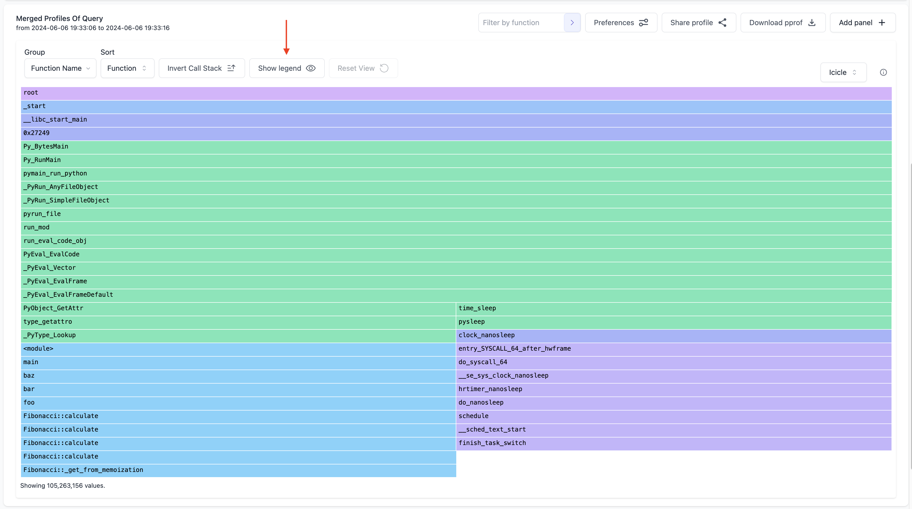
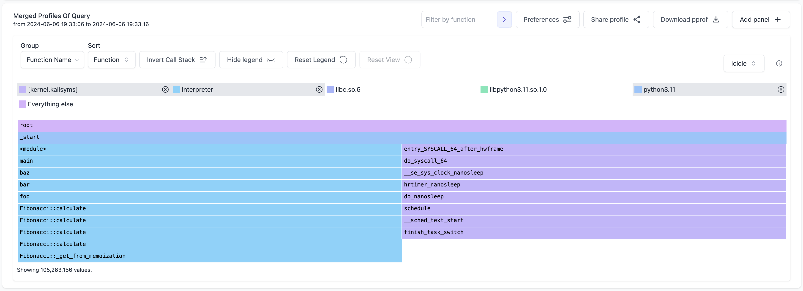

# Binary Filtering

import BrowserWindow from "@site/src/components/BrowserWindow";

Parca allows filtering profiles by their associated binary. This is useful to narrow down the scope of a profile to a specific binary or set of binaries.

### How to use it

To use the binary filter feature, you need to be using a color profile that allows for binary filtering. Click on the "Preferences" button to load the preferences modal. In the preferences modal, you will see a section called "Flamegraph Color Profile". Ensure any of the color profiles except the "Neutral" option is selected. The "Neutral" option does not support binary filtering.

<BrowserWindow>

</BrowserWindow>
 

To see the list of the binaries in the profile, click on the "Show Legend" button to show the legend. The legend shows the list of binaries in the profile. You can now click on any binary name to filter the profile by the binary.

<BrowserWindow>

</BrowserWindow>
 
<BrowserWindow>

</BrowserWindow>

 
The example above specifically works for when you want to only see data in the icicle
graph for a particular binary. So how about when you want to see data in the icicle
graph excluding a particular binary? You can do this by right-clicking on the frame
in the icicle graph and then click on the "Hide Binary" option. This will hide the
data for the binary you right-clicked on.

<BrowserWindow>

</BrowserWindow>

 

<BrowserWindow>

</BrowserWindow>

 

In addition to that, you can hide multiple binaries at a time! Using the same icicle graph as above, we also want to hide the <em>libc.so.6</em> frames.

<BrowserWindow>

</BrowserWindow>
 
<BrowserWindow>

</BrowserWindow>
 

To get the icicle graph back to its initial state, there's a "Reset Legend" button to reset the icicle graph.

<BrowserWindow>

</BrowserWindow>
