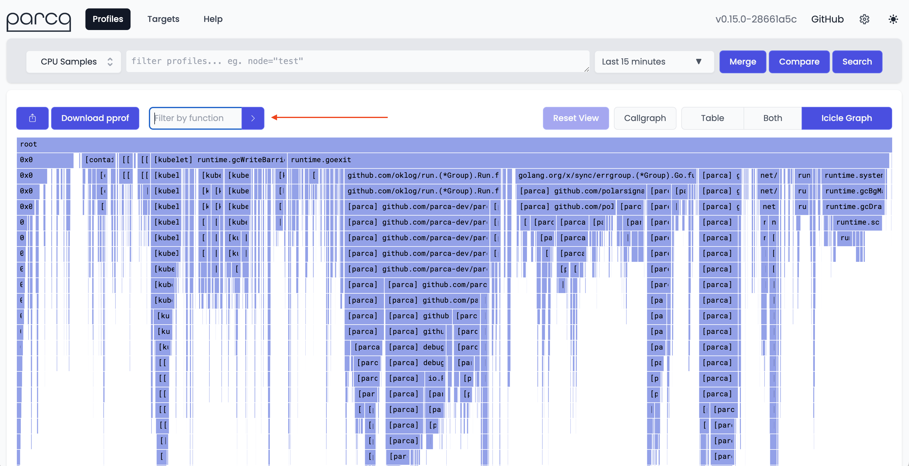
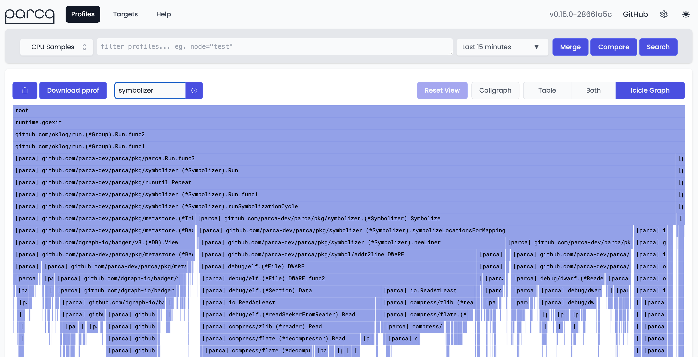
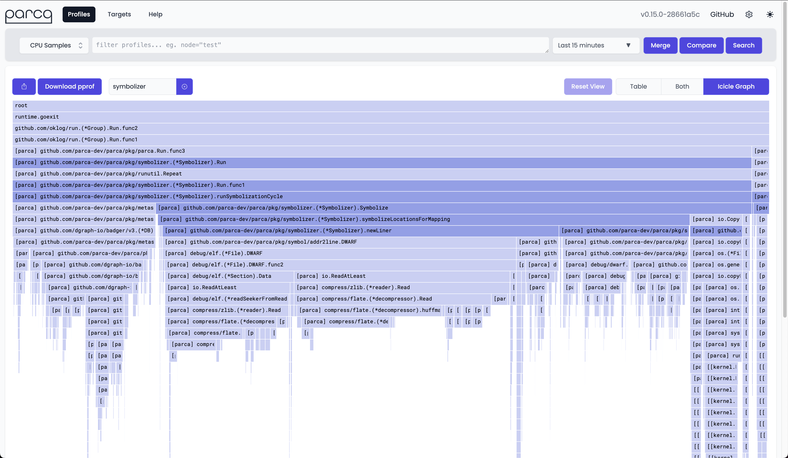

# Filter By Function

import BrowserWindow from "@site/src/components/BrowserWindow";

Parca allows filtering profiles by function name. This is useful to narrow down the scope of a profile to a specific function or set of functions.
This is useful to understand how a specific function is doing, or to understand how a set of functions interacting with a specific function is behaving.

### How it works

The filter by function feature filters the samples to retain only the ones that has at least one node matching the given text pattern. The text pattern can be a substring of a function name or a package name. The filter is case-insensitive.

### How to use it

Find the "Filter by function" input box in the visualization bar above the flame graph. Enter the text pattern and press enter. The flame graph will be updated to show only the samples that have at least one function matching the given text pattern.

<BrowserWindow>

</BrowserWindow>

The picture below shows the result of filtering with pattern `symbolizer`. The flame graph shows only the samples that have at least one node matching the `symbolizer` text.

<BrowserWindow>

</BrowserWindow>

 
This way, you can filter the samples to show only the ones that are of interest to
you when you're troubleshooting a performance issue.

### Highlight matching nodes

You can also highlight the nodes that match the given text pattern. This is useful to understand how the matching nodes are interacting with the rest of the graph. To enable this feature, check the "Highlight matching nodes after filtering" checkbox in the preferences modal.

<BrowserWindow>

</BrowserWindow>

 
This is what the flame graph looks like after enabling the "Highlight matching nodes
after filtering" feature.

<BrowserWindow>

</BrowserWindow>
