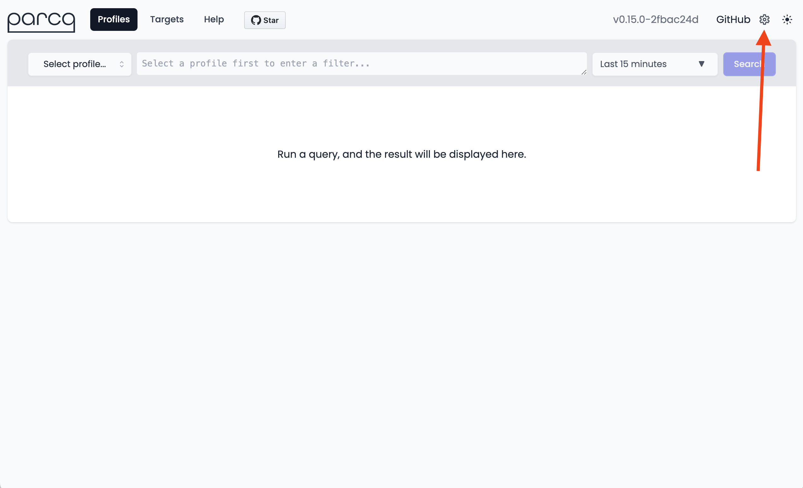
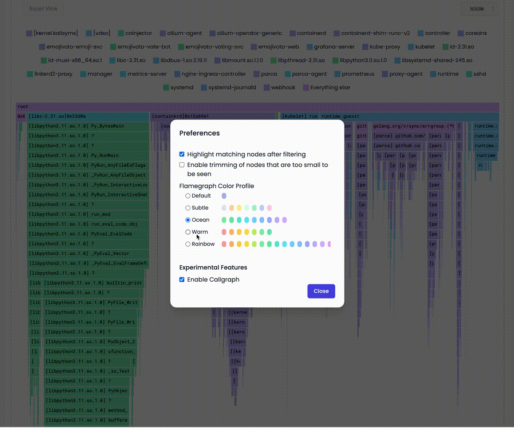
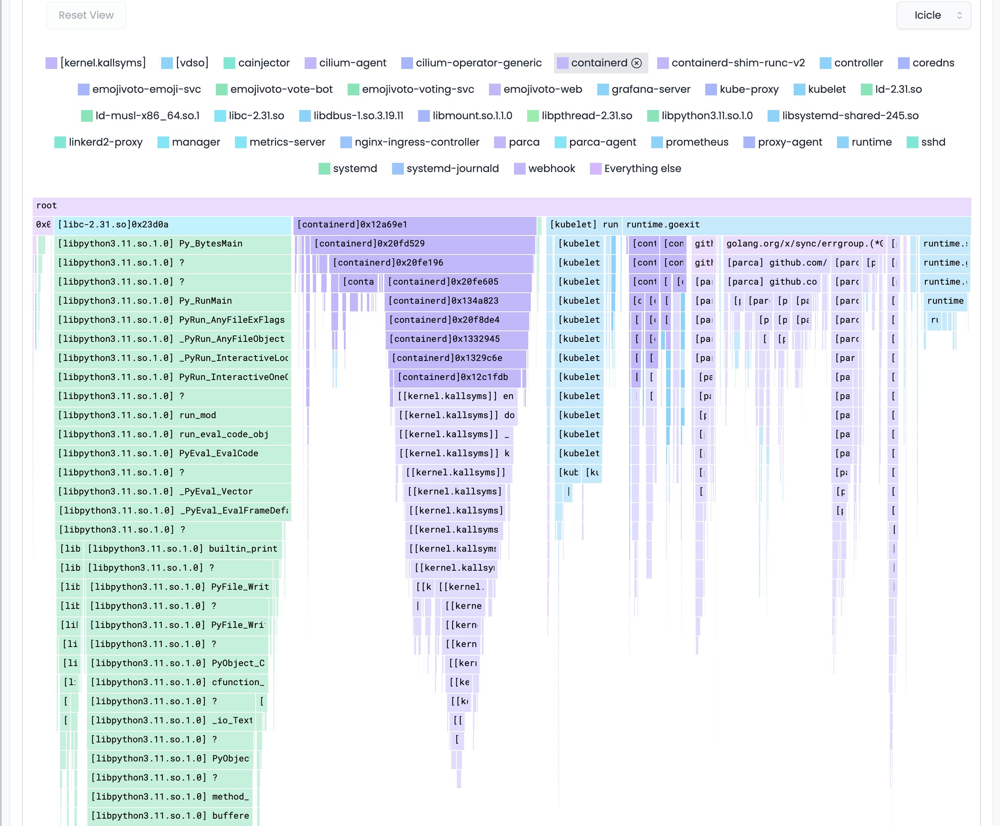

# Binary-based Color Stack

import BrowserWindow from '@site/src/components/BrowserWindow';

For quick troubleshooting, you can use the binary-based color stack mode to quickly identify the most expensive binaries in the rendered flamegraph. In binary-based color stack mode, the colour of a node in the flamegraph is based on the
binary that the function belongs to. This way, you can quickly identify the most expensive binaries in the given profile.

### How to use it
Open the User Preferences dialog by clicking the gear icon in the top-right corner of the UI.

<BrowserWindow>

</BrowserWindow>
 

In the User Preferences dialog, select your preferred color profile in the `Flamegraph Color Profile` section and click `Close`.

<BrowserWindow>

</BrowserWindow>
 

:::tip
You can always switch back to the `Default` color profile to disable the binary-based color stack mode.
:::

 

You can also click on the `Binary` names at the top to highlight the nodes corresponding to that binary in the flamegraph.

<BrowserWindow>

</BrowserWindow>
 