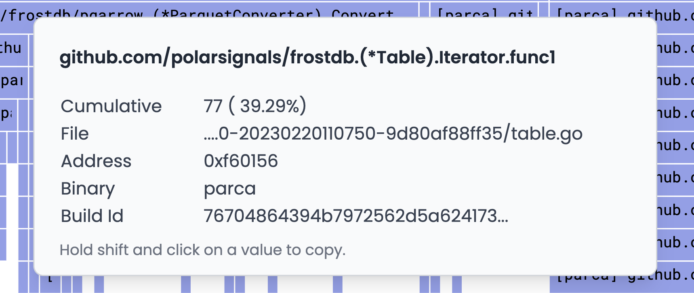
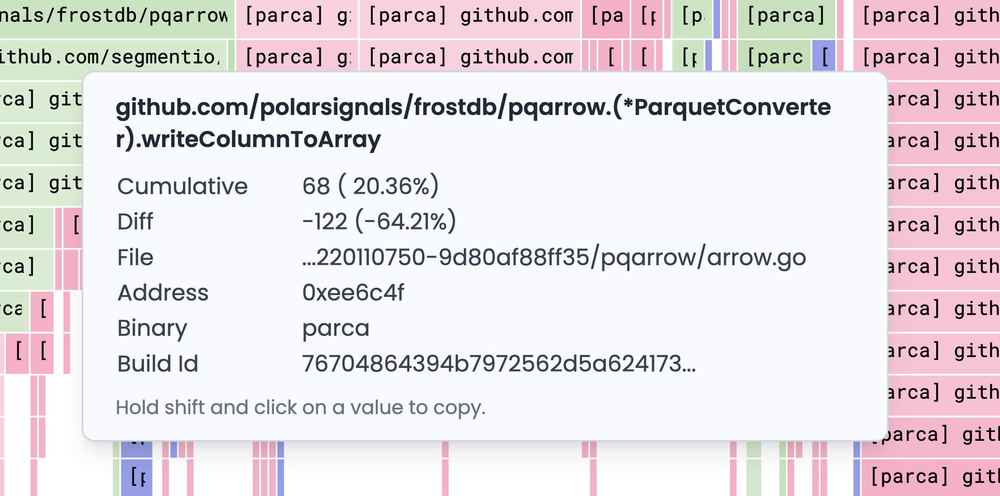

# Graph Tooltip Details

import BrowserWindow from "@site/src/components/BrowserWindow";

Here are some detailed explanations of the information that is displayed in the graph tooltip.

<BrowserWindow>

</BrowserWindow>

## Cumulative

This is the total number of times the function has been called. This is the sum of all the samples that have been collected for this function. Cumulative samples are displayed in the graph as a solid line.

## Diff

When in compare mode, the Diff value will display the difference between the number of samples for the function in the current graph and the number of samples for the function in the graph that is being compared to. If the number is positive, it means that the function was called more times in the current graph than in the graph that is being compared to. If the number is negative, it means that the function was called more times in the graph that is being compared to than in the current graph. If the function was called the same number of times in both graphs, then the Diff value will be skipped.

<BrowserWindow>

</BrowserWindow>

## File

The name of the file that the function is in. If the file is not in the project, it will be displayed as an absolute path. If the file is in the project, it will be displayed as a relative path.

## Address

The address of the function in memory. This is a pointer to the function in memory. The addresses are displayed in hexadecimal and are prefixed with `0x`.

## Binary

The name of the binary that the function is in. Using the [Binary-based Color Stack](./icicle-graph-binary-based-colour-stack.mdx) feature, you can identify the most expensive binaries in the rendered flamegraph.

## Build ID

The build ID of the binary that the function is in. The build ID is a unique identifier for the binary. It is used to match the binary to the debug information that is stored in the symbol server.
