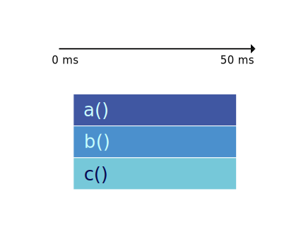
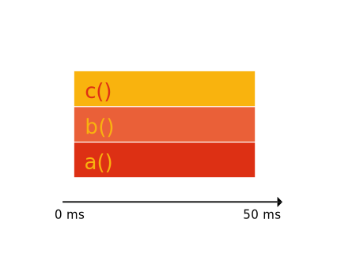
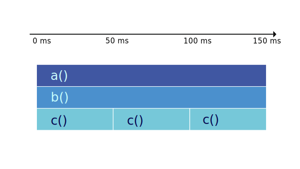
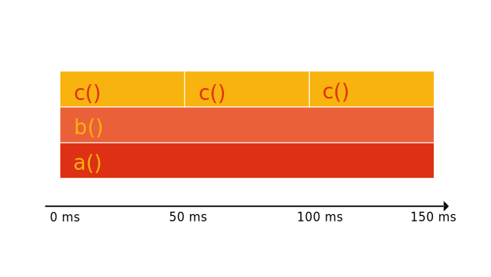
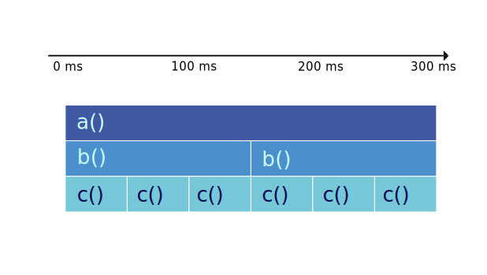
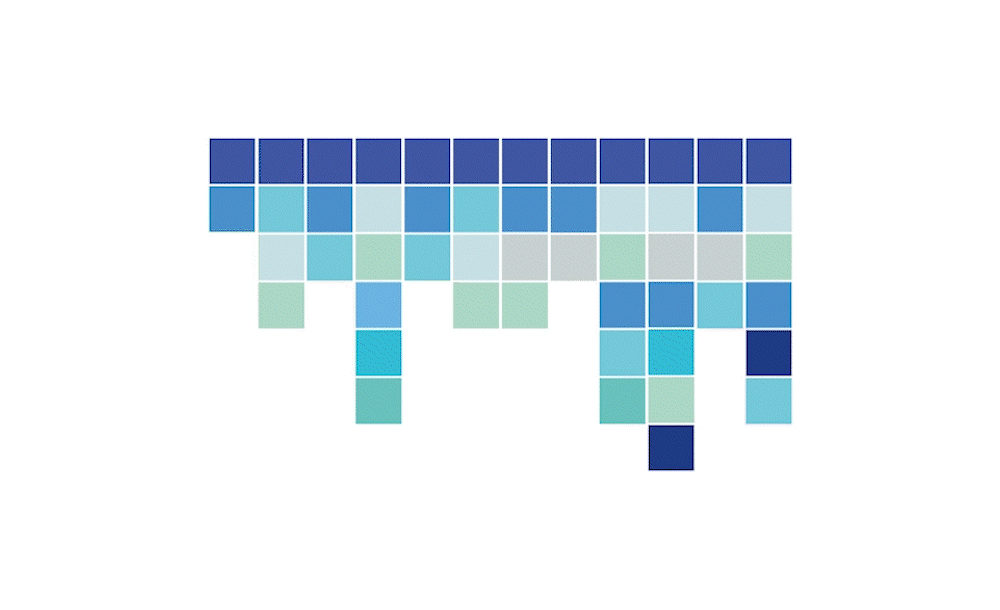

# Anatomy of icicle and flame graphs

import Tabs from '@theme/Tabs';
import TabItem from '@theme/TabItem';

An icicle graph or a flame graph basically shows the call stack of a program.
The width of the rectangle represents the time spent on CPU for a function.
The height of the rectangle represents the depth of the call stack.

## Example

Let's see that on an example. The following program calls a function `a` which
calls a function `b` which calls a function `c` and then loops forever.

```go
package main

func c() {
    for {}
}

func b() {
    c()
}

func a() {
    b()
}

func main() {
    a()
}
```


<Tabs groupId="graph-type" queryString>
<TabItem value="icicle" label="Icicle" default>

The key aspect of icicle graphs is that they are drawn from the top to the bottom.



</TabItem>
<TabItem value="flame" label="Flame">

The key aspect of flame graphs is that they are drawn from the bottom to the top.



</TabItem>
</Tabs>

And this example the majority of time is spent in the function `c`.
Let's add more calls to `c` and see how the graph changes.

```diff
package main

func c() {
    for {}
}

func b() {
    c()
+    c()
+    c()
}

func a() {
    b()
}

func main() {
    a()
}
```

<Tabs groupId="graph-type" queryString>
<TabItem value="icicle" label="Icicle" default>



</TabItem>
<TabItem value="flame" label="Flame">



</TabItem>
</Tabs>

In the same way, let's add more calls to `b` and see how the graph changes.

```diff
package main

func c() {
    for {}
}

func b() {
    c()
    c()
    c()
}

func a() {
    b()
+    b()
}

func main() {
    a()
}
```

<Tabs groupId="graph-type" queryString>
<TabItem value="icicle" label="Icicle" default>



</TabItem>
<TabItem value="flame" label="Flame">


</TabItem>
</Tabs>


This is how we visualize a single call stack collected from a program.

## Continuous profiling

However, in the life-cycle of a program, there are many call stacks.
Even in a second, a program can have thousands of calls and in a profile that we collected from a program for a minute,
there can be millions of call stacks. So, we need to reduce collected data to feasibly manage it.
For that we take samples of call stacks for a given interval and then aggregate them.

### Sampling

Sampling is the process of taking a sample of call stacks for a given interval.


### Sorting

Then we sort the samples alphabetically.
Because even the samples are taken for a given interval are aggregated and the order of the samples is not guaranteed.
And our goal is to determine the bottlenecks of the programs.
There are other ways (e.g. tracing) to collect and represent the call stacks but we will focus on sampled profiling here.



### Merging (Grouping)

Then we merge the samples with the same call stack.


Let's see everything together.


This is how a profile collected and represented in icicle graphs or flamegraphs.

------------

## Sources

- https://www.brendangregg.com/FlameGraphs/cpuflamegraphs.html
- https://queue.acm.org/detail.cfm?id=2927301
- https://youtu.be/6uKZXIwd6M0
- https://youtu.be/6uKZXIwd6M0
- https://www.webperf.tips/tip/understanding-flamegraphs/
