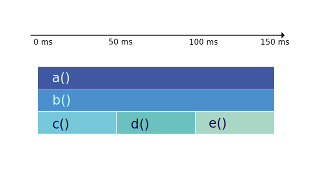
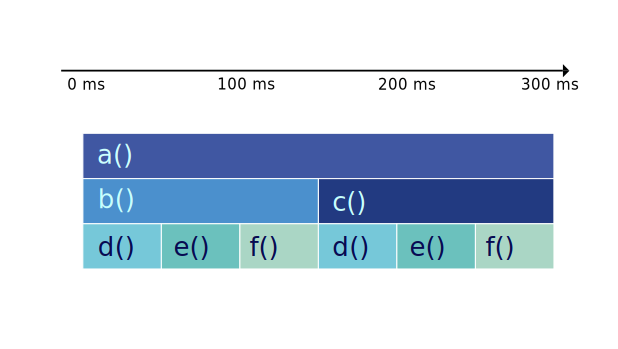

# Anatomy of icicle and flame graphs

import Tabs from '@theme/Tabs';
import TabItem from '@theme/TabItem';
import Animation from '@site/src/components/Animation';

In the simplest terms, an icicle graph or a flame graph shows a program's call stack. But what does that mean?

## Anatomy of a single profile

### Structure

The graphs represent the call stack data as a series of horizontally-aligned rectangles.
Each rectangle corresponds to a function, and its width represents the time spent in that function,
including the resource (time, memory, etc.) used in its child functions.

The rectangles are stacked on top of one another, with the parent function at the bottom and the child functions above it.
The hierarchy and the relationship between different functions can be easily understood by following the vertical alignment of the rectangles.

:::info

The critical aspects of icicle and flame graphs are:
- The width of each rectangle represents the relative resource usage for a function, including the time spent in its child functions.
- The height of the rectangles does NOT represent anything. The vertical alignment of the rectangles is used to describe the call stack hierarchy.

:::

### Colors

In both icicle and flame graphs, colors are used to visually differentiate functions and make the graphs more readable.
The colors usually do not carry any specific meaning related to performance data.
Instead, they are chosen to make distinguishing between different functions and their relationships within the call stack hierarchy easier.

Typically, colors are assigned randomly or based on a hashing algorithm applied to the function names.
This ensures that adjacent rectangles representing different functions have contrasting colors,
making it easier to identify and trace individual functions within the graph.

However, some tools may allow you to customize the color scheme or use colors to represent additional information,
such as memory usage or specific categories of functions (e.g., I/O-bound, CPU-bound, etc.).

In such cases, the color assignments and their meanings depend on the specific tool or configuration used to generate the icicle or flame graph.
Always refer to the documentation or legend accompanying the graph to understand the color representation if it carries any specific meaning in your particular case.

For example, in parca.dev we use the following color palette for icicle graphs:

<BrowserWindow>


</BrowserWindow>

:::info
Conventionally, the top-to-bottom order of the call stacks looks like icicles. And the color palette is chosen from rather cold colors.

On the other hand, the bottom-to-top order of the call stacks looks like flames. And the color palette is chosen to represent a flame.
:::

:::caution
The colors usually do not carry any specific meaning related to performance data.

If the rectangle are red in color, it does NOT mean that the function is taking relatively more resources.
:::

---

Easy, right? Let's see how we can visualize a single call stack collected from a program.

### Walk-through

Let us see how we can visualize a single call stack collected from a program.

The following program calls a function `a` which calls a function `b` which calls a function `c` and then loops forever.

```go
package main

func c() {
    for {}
}

func b() {
    c()
}

func a() {
    b()
}

func main() {
    a()
}
```

---

:::caution

The colors usually do not carry any specific meaning related to performance data.

:::

When we profile the above program for let say `50ms`, we get the following profile represented as flame or icicle graph.

<Tabs groupId="graph-type" queryString>
<TabItem value="icicle" label="Icicle" default>

The key aspect of icicle graphs is that they are drawn from **the top to the bottom**.


</TabItem>
<TabItem value="flame" label="Flame">

The key aspect of flame graphs is that they are drawn from **the bottom to the top**.


</TabItem>
</Tabs>

Even though, in this example, the majority of time is spent in the function `c`, all the rectangles have the same width.

:::info This is because the width of the rectangle for a function represents the time spent in that function and its child functions.
:::

---

Let's add more calls to `c` and see how the graph changes.

```diff
package main

func c() {
    for {}
}

func b() {
    c()
+    c()
+    c()
}

func a() {
    b()
}

func main() {
    a()
}
```


You can observe that the instances of the rectangle for the function `c` have increased.
And the rectangle for the function `b` covers them call.

:::info This is because the width of the rectangle for the function `b` represents the time spent in the function `b` and its child functions.
:::

<Tabs groupId="graph-type" queryString>
<TabItem value="icicle" label="Icicle" default>



</TabItem>
<TabItem value="flame" label="Flame">


</TabItem>
</Tabs>

---

In the same way, let's add more calls to `b` and see how the graph changes.

```diff
package main

func c() {
    for {}
}

func b() {
    c()
    c()
    c()
}

func a() {
    b()
+    b()
}

func main() {
    a()
}
```

You can observe that the instances of the rectangle for the function `b` have increased.
And each of the rectangles for the function `b` covers the calls that made against `c`.

<Tabs groupId="graph-type" queryString>
<TabItem value="icicle" label="Icicle" default>



</TabItem>
<TabItem value="flame" label="Flame">


</TabItem>
</Tabs>

This is how we visualize a single call stack collected from a program.
But happens when we collect multiple call stacks over time?

Let's see.

## Anatomy of Continuous profiling

In the life-cycle of a program, there are many call stacks.
Even in a second, a program can have thousands of calls and in a profile that we collected from a program for a minute,
there can be millions of call stacks. And we you profile a host with multiple programs running, there can be billions of call stacks.

We need to reduce collected data to feasibly manage it. For that we take samples of call stacks for a given interval and then aggregate them.

There are three major steps in the process of aggregating call stacks and building a profile.
Let's see them one by one. And visualize the process with animations using the graphs.

### Sampling

Sampling is the process of taking a sample of call stacks for a given interval.

You can see below that we take samples for a given interval (e.g. 50ms), over a period of time (e.g. 1 minute).

<Tabs groupId="graph-type" queryString>
<TabItem value="icicle" label="Icicle" default>

<Animation src={require('../static/anim/graphs/sampling_ig.riv').default} />

</TabItem>
<TabItem value="flame" label="Flame">

<Animation src={require('../static/anim/graphs/sampling_fg.riv').default} />

</TabItem>
</Tabs>

### Sorting

:::info Stack traces in a graph are sorted alphabetically.
:::

We sort the samples alphabetically, because even the samples are taken for a given interval are aggregated and the order of the samples is not guaranteed.
And our goal is to determine the bottlenecks of the programs. Thus we do not need to keep the order of the samples.

<Tabs groupId="graph-type" queryString>
<TabItem value="icicle" label="Icicle" default>

<Animation src={require('../static/anim/graphs/sorting_ig.riv').default} />

</TabItem>
<TabItem value="flame" label="Flame">

<Animation src={require('../static/anim/graphs/sorting_fg.riv').default} />

</TabItem>
</Tabs>

### Merging (Grouping)

Lastly, we merge the samples that have the same call stack.

:::caution We only merge the samples that have the same call stack.
:::

We do not merge the samples that have the same function name, even if they are in the level.

<Tabs groupId="graph-type" queryString>
<TabItem value="icicle" label="Icicle" default>

<Animation src={require('../static/anim/graphs/grouping_ig.riv').default} />

</TabItem>
<TabItem value="flame" label="Flame">

<Animation src={require('../static/anim/graphs/grouping_fg.riv').default} />

</TabItem>
</Tabs>

----

Let's see everything together.

<Tabs groupId="graph-type" queryString>
<TabItem value="icicle" label="Icicle" default>

<Animation src={require('../static/anim/graphs/all_ig.riv').default} />

</TabItem>
<TabItem value="flame" label="Flame">

<Animation src={require('../static/anim/graphs/all_fg.riv').default} />

</TabItem>
</Tabs>

This is how a profile collected and represented in icicle graphs or flame graphs can provide valuable insights into the performance of your software,
enabling you to identify bottlenecks and optimize code effectively.

By visualizing the call stack data clearly and intuitively,
these graphs make it easier for developers to understand the complex relationships between functions and their resource consumption.

Whether you choose to work with icicle graphs, which emphasize cumulative time spent in functions and their children, or flame graphs,
which focuses on the self-time of individual functions,
these powerful visualization tools can significantly enhance your ability to analyze performance data,
and improve your software's performance and user experience.

We hope you enjoyed this article and learned something new :)

##### Sources

- https://www.brendangregg.com/FlameGraphs/cpuflamegraphs.html
- https://queue.acm.org/detail.cfm?id=2927301
- https://youtu.be/6uKZXIwd6M0
- https://youtu.be/6uKZXIwd6M0
- https://www.webperf.tips/tip/understanding-flamegraphs/
