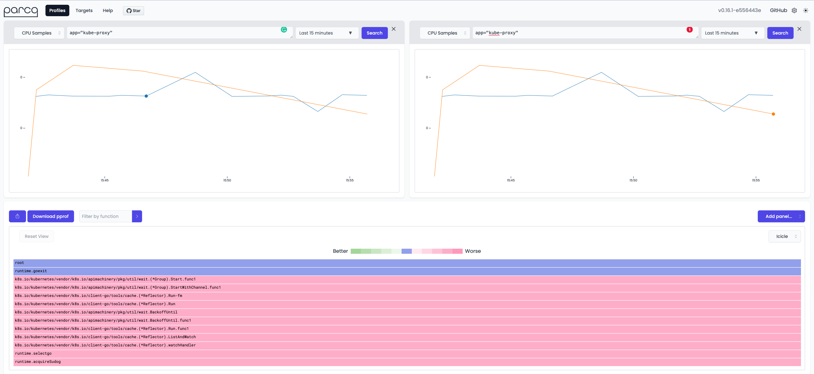

# How to interpret icicle and flame graphs?

import Tabs from '@theme/Tabs';
import TabItem from '@theme/TabItem';
import BrowserWindow from '@site/src/components/BrowserWindow';

Have you ever faced performance issues while developing or maintaining a software application?
Visualizing and analyzing performance data can be quite a challenge, especially when dealing with complex systems.

Enter icicle and flame graphs - two powerful visualization tools that can help you identify bottlenecks and optimize your code.

In this document, we'll delve into their importance, how they work, and how you can use them to improve your software's performance.

### Why?

Performance optimization is crucial for any software application, as it can greatly impact the user experience and system resources.
However, identifying the causes of performance issues can be a daunting task, especially when dealing with large code-bases and complex call stacks.
This is where icicle and flame graphs come in handy.

1. **Visualizing complex data:** Icicle and flame graphs provide a graphical representation of the call stack data, making it easier to visualize and understand the relationships between different functions and their resource consumption.

2. **Identifying bottlenecks:** By visualizing the call stack data, icicle and flame graphs enable developers to identify performance bottlenecks, such as functions consuming a significant amount of CPU time or memory.

3. **Comparing different profiles:** Icicle and flame graphs can be used to compare different profiles, helping developers understand the impact of changes in the code-base and make informed decisions about potential optimizations.

4. **Platform-agnostic:** Both icicle and flame graphs can be generated from various programming languages and platforms, making them versatile tools for developers working on diverse projects.

### How?

#### Finding Performance Issues

1. **Look for wide blocks:**
Start by analyzing the icicle or flame graph to identify functions that consume a significant amount of resources, such as CPU time or memory.
These functions are usually represented by wider rectangles in the graph, indicating that they are taking up a large portion of the total execution time.
Make a list of these functions as potential targets for optimization.

:::tip Wider blocks indicate a higher resource usage or longer duration. Focus on these blocks to identify potential bottlenecks.
:::

2. **Examine the call stack:**
Examine the call stack hierarchy to understand the relationship between different functions.
This will help you identify if the performance issue is caused by a single function or a combination of functions.
Understanding the call stack can also reveal opportunities for optimization, such as refactoring or eliminating redundant calls.

3. **Look for tall stacks:**
In flame graphs, tall stacks indicate deep call hierarchies, which may signify complex and inefficient code.

2. **Examine recurring patterns:**
Repeated patterns in the graph may indicate redundant or repetitive code that could be optimized.

##### Comparing Versions

1. **Overlay graphs:**
Overlay two graphs to compare different versions of the same system, making it easy to identify improvements or regressions.

2. **Analyze differences:**
Look for changes in block width or stack height to determine if specific functions have become more or less efficient.

:::tip
You're lucky! We got you covered. You can easily compare graphs using Parca.
Go and check it out! https://demo.parca.dev
:::

<BrowserWindow src="https://demo.parca.dev">

</BrowserWindow>

Icicle and flame graphs are powerful tools for visualizing and analyzing system performance.
By understanding how to interpret these graphs, you can identify bottlenecks and optimize resource usage within your system.

#### Optimize the code

Once you have identified the problematic functions and analyzed the call stack, start optimizing the code. This may involve:

a. **Optimizing algorithms:**
Replace inefficient algorithms with more efficient ones or use data structures that provide better performance for the specific use case.

b. **Reducing function call overhead:** Minimize the number of function calls, especially in performance-critical code paths.

c. **Parallelizing code:**
If the performance bottleneck is caused by CPU-bound operations, consider parallelizing the code to take advantage of multiple processor cores.

d. **Reducing memory usage:**
Optimize memory allocation and de-allocation, and minimize memory fragmentation.

#### Measure the impact

After making optimizations, collect new profiling data and generate updated icicle or flame graphs.
Compare the new graphs with the previous ones to measure the impact of your changes.
If the optimizations have been successful, you should see a reduction in the width of the problematic functions and an overall improvement in the application's performance.

#### Iterate and refine

Performance optimization is an iterative process.
Continue to analyze the updated graphs, identify new bottlenecks, and optimize your code accordingly.
Keep refining your optimizations until you achieve the desired performance level.

You can leverage icicle and flame graphs to optimize your software's performance effectively.

By identifying bottlenecks, understanding the call stack hierarchy, optimizing code, measuring the impact, and iterating on the process,
you can significantly enhance the performance and user experience of your software application.
