# How to interpret icicle and flame graphs?

import Tabs from '@theme/Tabs';
import TabItem from '@theme/TabItem';

Both icicle and flame graphs are visual representations of stack traces that can help you understand where your application is spending its resources (time, memory, etc).
They are particularly useful for visualizing performance bottlenecks and optimizing your code to reduce the resources spent in certain functions or code blocks.

Let's take a look at how to interpret icicle and flame graphs.

<Tabs groupId="graph-type" queryString>
<TabItem value="icicle" label="Icicle" default>

Here's a quick summary of how to interpret icicle graphs:

1. Each rectangle represents a function call in the stack.
2. The y-axis shows stack depth (number of frames on the stack). The bottom rectangle shows the function that was consuming the resource. Everything above represents ancestry. The function above a function is its parent.
3. The x-axis spans the samples. It does not show the passing of time, as most of the time-series graphs do. It's sorted alphabetically to maximize merging.
4. The width of the rectangle shows the total resource usage. Functions with wide rectangles may consume more resource per execution than narrow rectangles, or, they may simply be called more often.

_The colors do not represent anything significant, and are usually picked at random to be warm colors (other meaningful palettes are supported)._
This visualization was called an "icicle graph", it looks like icicles. So the colors are chosen to be cold colors.

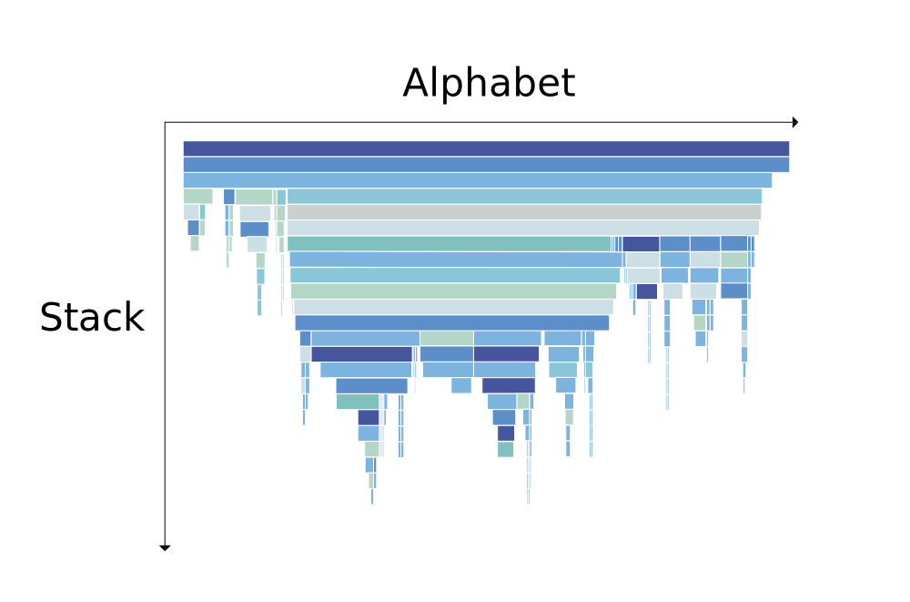

</TabItem>
<TabItem value="flame" label="Flame">

Here's a quick summary of how to interpret flame graphs:

1. Each rectangle represents a function call in the stack.
2. The y-axis shows stack depth (number of frames on the stack). The top rectangle shows the function that consuming the resource. Everything beneath represents ancestry. The function beneath a function is its parent.
3. The x-axis spans the samples. It does not show the passing of time, as most of the time-series graphs do. It's sorted alphabetically to maximize merging.
4. The width of the rectangle shows the total resource usage. Functions with wide rectangles may consume more resource per execution than narrow rectangles, or, they may simply be called more often.

_The colors do not represent anything significant, and are usually picked at random to be warm colors (other meaningful palettes are supported)._
This visualization was called an "flame graph", it looks like flames. So the colors are chosen to be warm colors.

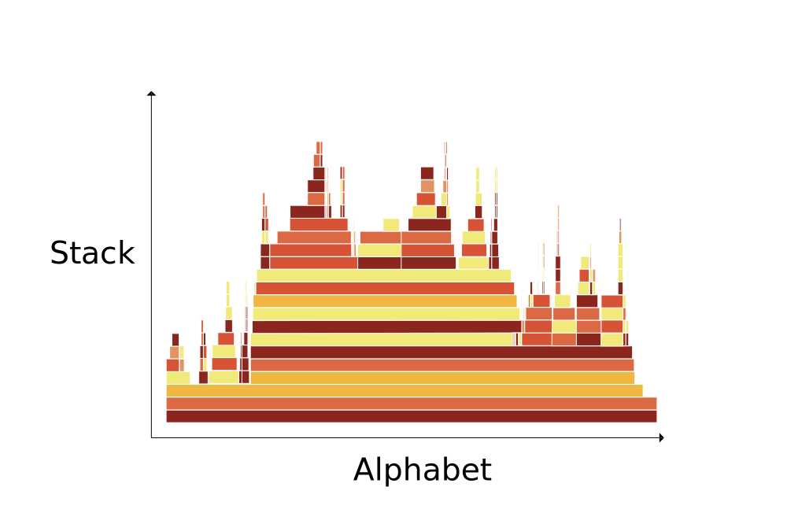

</TabItem>
</Tabs>

<Tabs groupId="graph-type" queryString>
<TabItem value="icicle" label="Icicle" default>

Let's take a look at an examples.

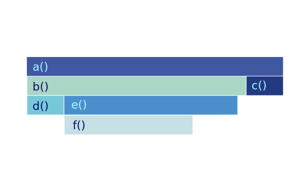

The bottom edge of the graph shows the function that was consuming the resource. In this case, they are `d`, `f`, and `c`.

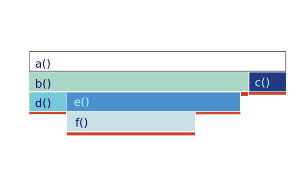

The vertical axis shows the stack depth. For example, one of the leaf is `f` function. The function above it is `f`'s parent, which is `f`'s caller. In this case, it's `e`. The function above `e` is `b`, and so on.

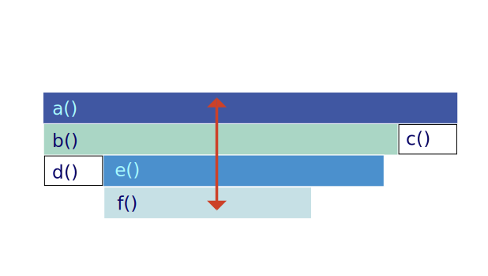

For example, in this case, `b` is consuming more resources than `c`.

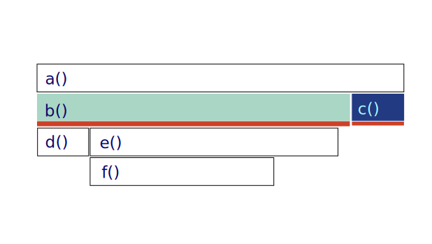

We can visually compare the length of the rectangles to see which function is consuming more resources.

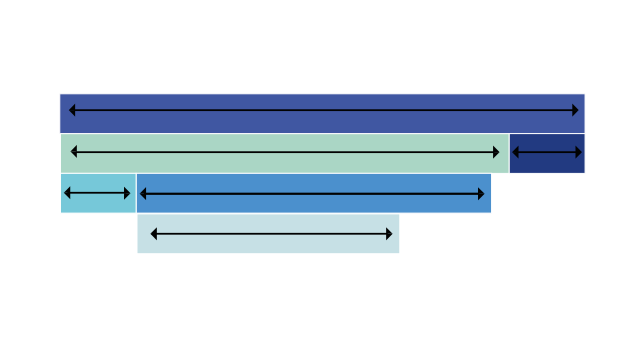

</TabItem>
<TabItem value="flame" label="Flame">

Let's take a look at an examples.

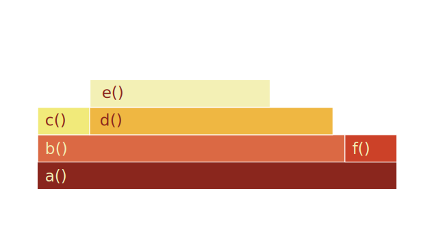

The bottom edge of the graph shows the function that was consuming the resource. In this case, they are `d`, `f`, and `c`.

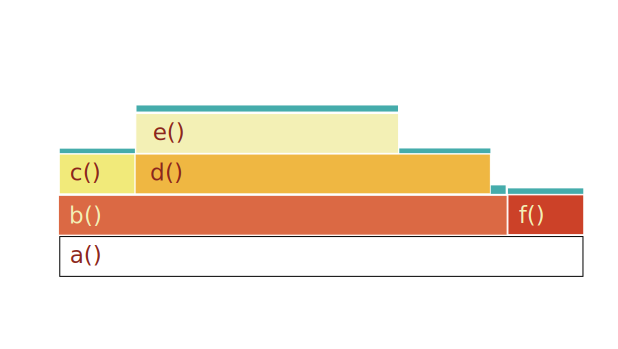

The vertical axis shows the stack depth. For example, one of the leaf is `f` function. The function above it is `f`'s parent, which is `f`'s caller. In this case, it's `e`. The function above `e` is `b`, and so on.

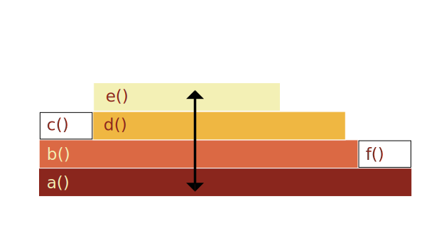

For example, in this case, `b` is consuming more resources than `c`.

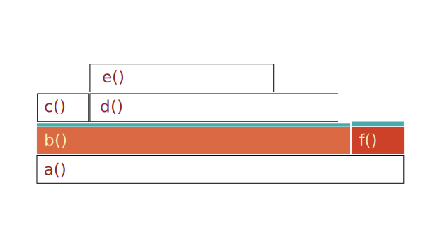

We can visually compare the length of the rectangles to see which function is consuming more resources.

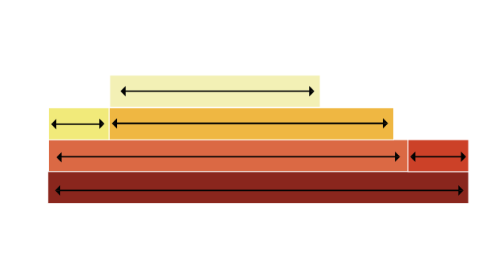

</TabItem>
</Tabs>

### Real-life Examples

<Tabs groupId="graph-type" queryString>
<TabItem value="icicle" label="Icicle" default>

<BrowserWindow>

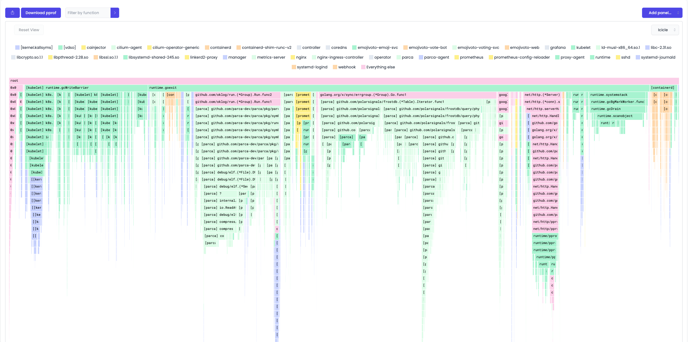
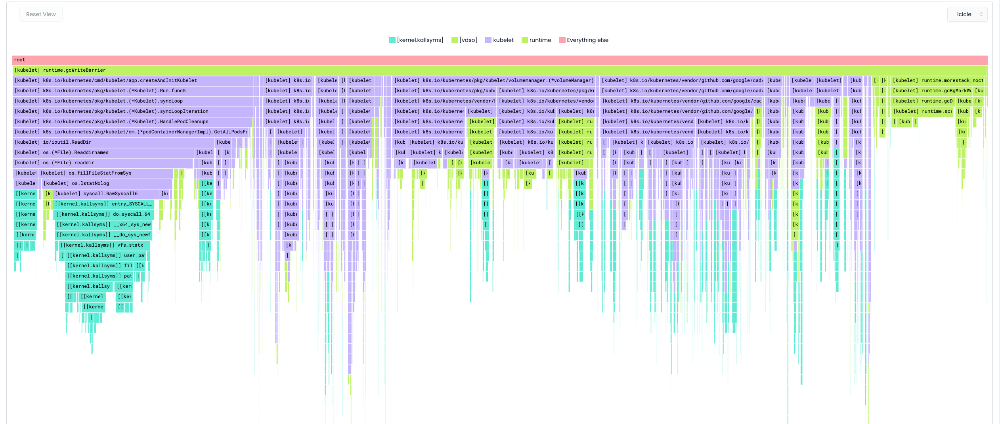

</BrowserWindow>

</TabItem>
<TabItem value="flame" label="Flame">

<iframe id="flamegraph" width="100%" height="600" frameborder="0" scrolling="no"
        src="https://www.brendangregg.com/FlameGraphs/cpu-bash-flamegraph.svg">
</iframe>

<iframe id="flamegraph" width="100%" height="600" frameborder="0" scrolling="no"
        src="https://www.brendangregg.com/FlameGraphs/example-perf.svg">
</iframe>

</TabItem>
</Tabs>

### Sources

- https://www.brendangregg.com/FlameGraphs/cpuflamegraphs.html
- https://queue.acm.org/detail.cfm?id=2927301
- https://youtu.be/6uKZXIwd6M0
- https://youtu.be/6uKZXIwd6M0
