# Understanding icicle and flame graphs

import Tabs from '@theme/Tabs';
import TabItem from '@theme/TabItem';
import BrowserWindow from '@site/src/components/BrowserWindow';

Icicle and flame graphs are essential visualization tools for analyzing performance data in various systems, like computer software, database systems, and web services.
These graphs visually represent a system's performance, making it easier to identify bottlenecks and optimize resource usage.

This document will guide you through understanding and interpreting icicle and flame graphs to improve your system's performance.

:::info To learn more about mechanics of icicle and flame graphs, check out the [Anatomy of icicle and flame graphs](/docs/icicle-graph-anatomy) page.
:::

Let's take a look at how to interpret icicle and flame graphs.

<Tabs groupId="graph-type" queryString>
<TabItem value="icicle" label="Icicle" default>

Here's a quick summary of how to interpret icicle graphs:

1. Each rectangle represents a function call in the stack.
2. The y-axis shows stack depth (number of frames on the stack). The bottom rectangle shows the function that was consuming cumulatively the most resource. Everything above represents ancestry. The function above a function is its parent.
3. The x-axis spans the samples. It does not show the passing of time, as most of the time-series graphs do. It's sorted alphabetically to maximize merging.
4. The width of the rectangle shows the total resource usage. Functions with wide rectangles may consume more resource per execution than narrow rectangles, or, they may simply be called more often.

:::caution The colors do not represent anything significant.

This visualization was called an "icicle graph", it looks like icicles.
They are usually picked at random to be cold colors (other meaningful palettes are supported).
:::

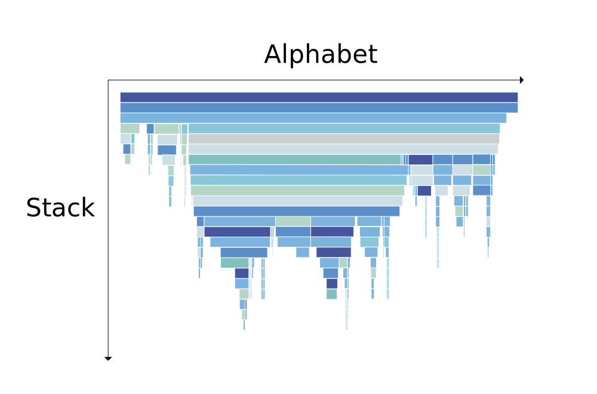

</TabItem>
<TabItem value="flame" label="Flame">

Here's a quick summary of how to interpret flame graphs:

1. Each rectangle represents a function call in the stack. The width of each rectangle represents the relative resource usage for a function, including the time spent in its child functions.
2. The y-axis shows stack depth (number of frames on the stack). The top rectangle shows the function that consuming cumulatively the most resource. Everything beneath represents ancestry. The function beneath a function is its parent.
3. The x-axis spans the samples. It does not show the passing of time, as most of the time-series graphs do. It's sorted alphabetically to maximize merging.
4. The width of the rectangle shows the total resource usage. Functions with wide rectangles may consume more resource per execution than narrow rectangles, or, they may simply be called more often.

:::caution The colors do not represent anything significant.

This visualization was called an "flame graph", it looks like flames. So the colors are chosen to be warm colors.
They are usually picked at random to be warm colors (other meaningful palettes are supported).
:::

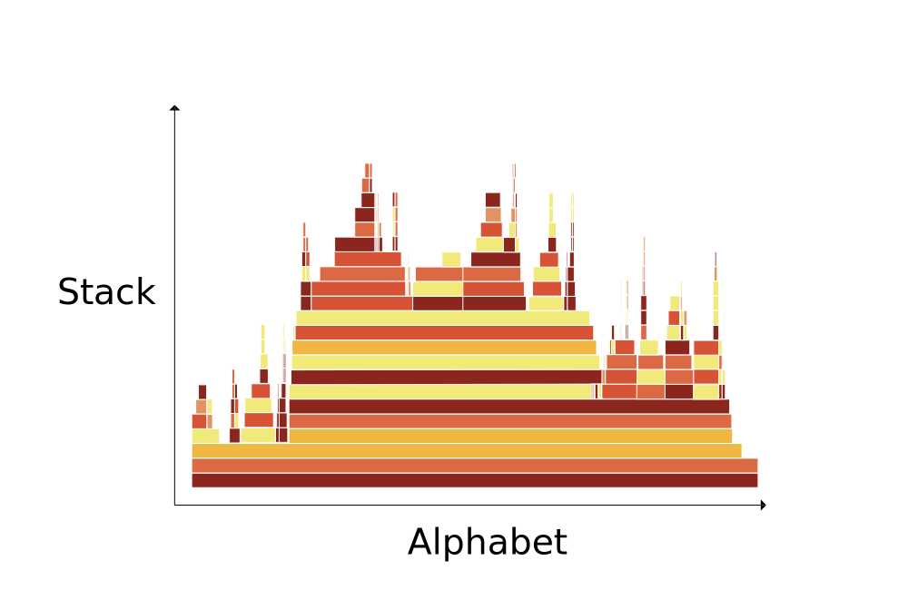

</TabItem>
</Tabs>

<Tabs groupId="graph-type" queryString>
<TabItem value="icicle" label="Icicle" default>

Let's take a look at an example profile.

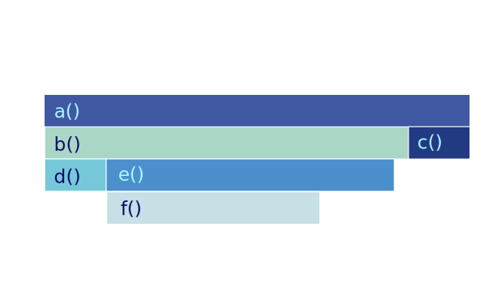

**The graph is a tree.** The root of the tree is the function that was consuming the most resource.
But it's cumulative. It's the sum of all the resources consumed by the function and its children.

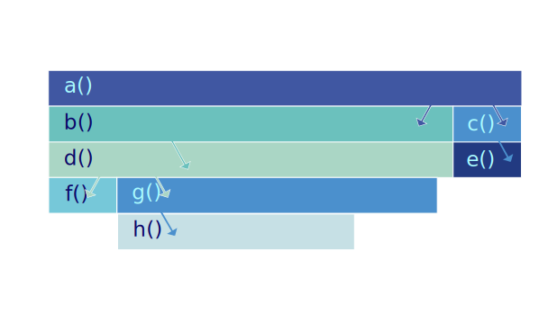

**The bottom edge of the graph shows the function that was solely consuming the mostly resource.**

In this case, they are `d`, `f`, and `c`.

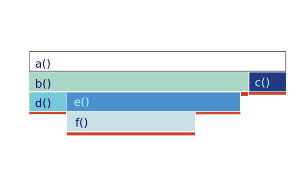

**The vertical axis shows the stack depth.**

For example, one of the leaf is `f` function.
The function above it is `f`'s parent, which is `f`'s caller. In this case, it's `e`. The function above `e` is `b`, and so on.

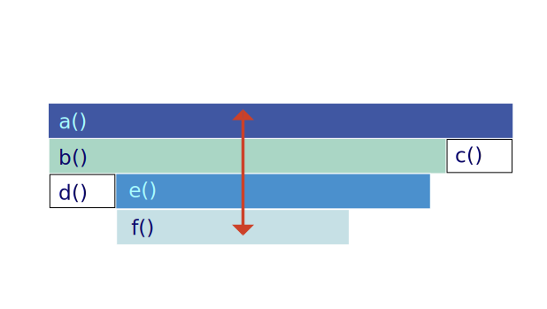

**We can visually compare the length of the rectangles to see which function is consuming more resources.**

For example, in this case, `b` is consuming more resources than `c`.

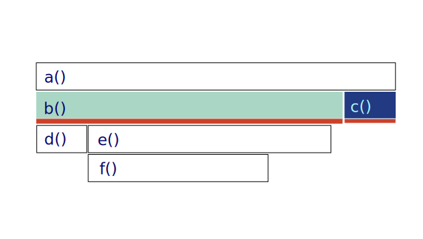

**The horizontal axis shows the samples.**

:::caution It does not show the passing of time, as most of the time-series graphs do.
:::

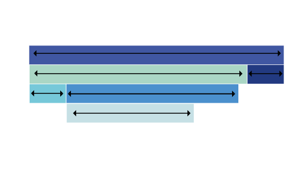

</TabItem>
<TabItem value="flame" label="Flame">

Let's take a look at an example profile.

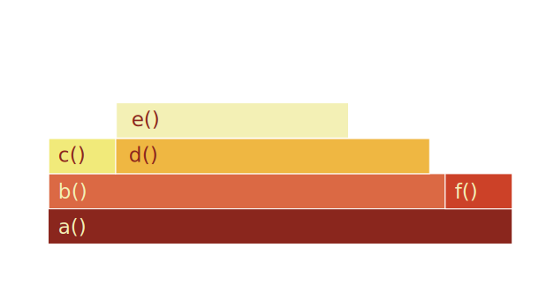

**The graph is a tree.** The root of the tree is the function that was consuming the most resource.
But it's cumulative. It's the sum of all the resources consumed by the function and its children.

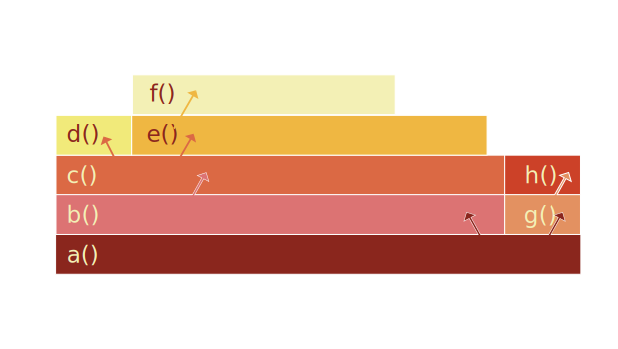

**The top edge of the graph shows the function that was solely consuming the mostly resource.**

In this case, they are `d`, `f`, and `c`.

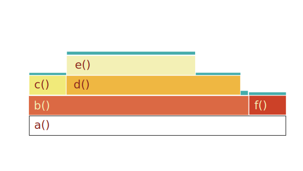

**The vertical axis shows the stack depth.**

For example, one of the leaf is `f` function.
The function above it is `f`'s parent, which is `f`'s caller. In this case, it's `e`. The function above `e` is `b`, and so on.

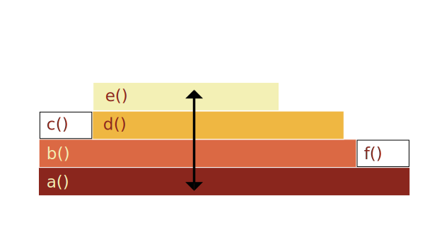

**We can visually compare the length of the rectangles to see which function is consuming more resources.**

For example, in this case, `b` is consuming more resources than `c`.

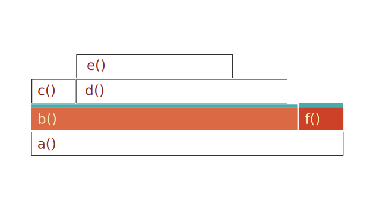

**The horizontal axis shows the samples.**

:::caution It does not show the passing of time, as most of the time-series graphs do.
:::

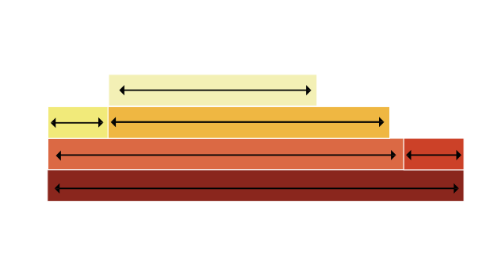

</TabItem>
</Tabs>

### Real-life Examples

<Tabs groupId="graph-type" queryString>
<TabItem value="icicle" label="Icicle" default>

<BrowserWindow url="https://demo.parca.dev/">

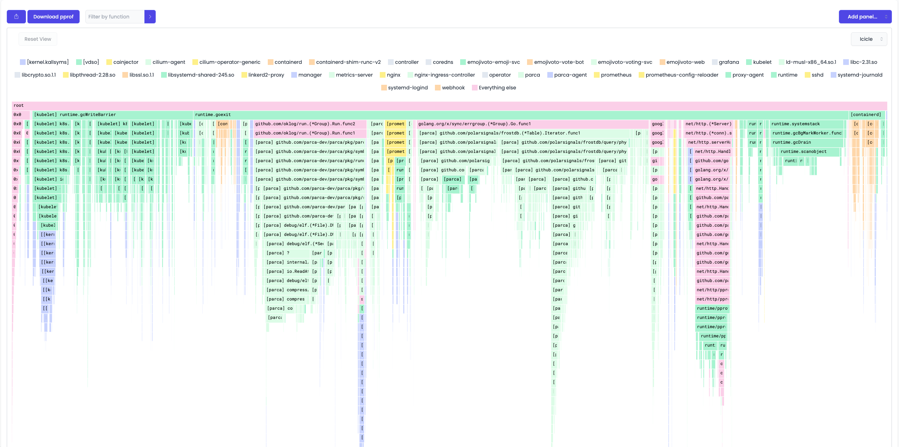

</BrowserWindow>

<BrowserWindow url="https://demo.parca.dev/">

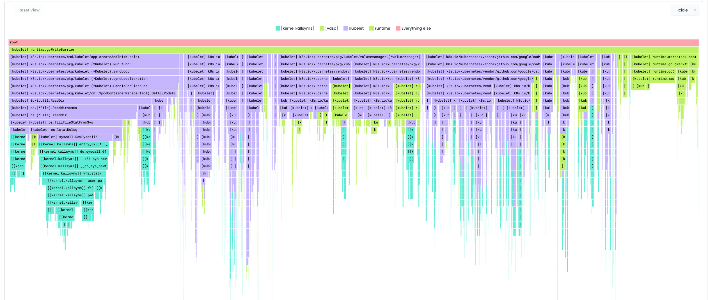

</BrowserWindow>

</TabItem>
<TabItem value="flame" label="Flame">

<iframe id="flamegraph" width="100%" height="600" frameborder="0" scrolling="no"
        src="https://www.brendangregg.com/FlameGraphs/cpu-bash-flamegraph.svg">
</iframe>

<iframe id="flamegraph" width="100%" height="600" frameborder="0" scrolling="no"
        src="https://www.brendangregg.com/FlameGraphs/example-perf.svg">
</iframe>

</TabItem>
</Tabs>

##### Sources

- https://www.brendangregg.com/FlameGraphs/cpuflamegraphs.html
- https://queue.acm.org/detail.cfm?id=2927301
- https://youtu.be/6uKZXIwd6M0
- https://youtu.be/6uKZXIwd6M0
