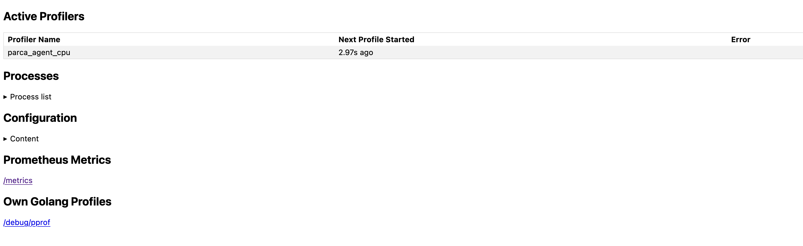

# Kubernetes

import WithVersions from '@site/src/components/WithVersions';
import CodeBlock from '@theme/CodeBlock';
import BrowserWindow from '@site/src/components/BrowserWindow';

:::tip

You can find interactive version of this tutorial at our Katacoda account. Check it out [here](https://www.katacoda.com/parca/scenarios/kubernetes).

:::

:::tip

To quickly try out the Parca and Parca Agent with Kubernetes, you create a [minikube](https://minikube.sigs.k8s.io/docs/) cluster with an actual virtual machine, e.g. Virtualbox:

```shell
minikube start --driver=virtualbox
```

:::

:::tip

To quickly try out the Parca and Parca Agent with Kubernetes on Apple Silicon machine (ARM architecture), you create a [Colima](https://github.com/abiosoft/colima) cluster with Kubernetes:

```shell
# Homebrew
brew install colima

colima start --kubernetes
```

:::

:::note

The Agent needs to access to Kernel and run as a privileged user to load necessary eBPF programs. Please check [our FAQ for further information](/docs/faq#since-parca-agent-has-to-run-as-root-for-ebpf-what-are-the-security-considerations).

:::

## Setting up Parca Server

Start by creating a namespace for Parca components to run in.

```shell
kubectl create namespace parca
```

:::note

Creating this namespace is not strictly necessary, but it prevents a race with the following commands, to make the guide more smooth.

:::

To provision the Parca against any Kubernetes cluster, and use the API and UI:

<WithVersions language="bash">
  { versions =>
    <CodeBlock className="language-bash">
      kubectl apply -f https://github.com/parca-dev/parca/releases/download/{versions.server}/kubernetes-manifest.yaml
    </CodeBlock>
  }
</WithVersions>

You can verify by selecting pods if everything runs as expected:

```shell
kubectl get pods -n parca

NAMESPACE     NAME                            READY   STATUS    RESTARTS   AGE
parca         parca-5f879c46ff-pv649          1/1     Running   0          53m
```

To view the Parca UI and access the API, we can port-forward using the default port `7070`:
```
kubectl -n parca port-forward service/parca 7070
```

Once the Parca is running, and you set up the port-forwarding. Now you can navigate through to the web interface on the browser by visiting visit `http://localhost:7070`.

However, at this stage, you shouldn't see any data. Parca hasn't ingested any data because we haven't configured any data source.

So let's set up Parca Agent in our cluster and collect data from our cluster.

## Setting up Parca Agent

First, let's make sure the namespace we are going to use is created (if you haven't already done this in the previous step):

```shell
kubectl create namespace parca
```

:::note

Creating this namespace is not strictly necessary, but it prevents a race with the following commands, to make the guide more smooth.

:::

To provision the Parca Agent as a `DaemonSet`:
<WithVersions language="bash">
  { versions =>
    <CodeBlock className="language-bash">
      kubectl apply -f https://github.com/parca-dev/parca-agent/releases/download/{versions.agent}/kubernetes-manifest.yaml
    </CodeBlock>
  }
</WithVersions>

You can verify by selecting pods if everything runs as expected:

```shell
kubectl get pods -n parca

NAME                        READY   STATUS    RESTARTS   AGE
parca-5f879c46ff-pv649      1/1     Running   0          54m
parca-agent-b66vt           1/1     Running   0          54m
```

Let's set up a port-forward using the default port `7071`.
```
kubectl -n parca port-forward `kubectl -n parca get pod -lapp.kubernetes.io/name=parca-agent -ojsonpath="{.items[0].metadata.name}"` 7071
```

Now we can view the active profilers by visiting `http://localhost:7071`:
<BrowserWindow>



</BrowserWindow>

<br/>

And all the discovered processes:
<BrowserWindow>


</BrowserWindow>

<br/>

To continuously send every profile collected to a Parca server configure the `--remote-store-address` and the potential credentials needed.
For example, to send to a Parca server in the `parca` namespace set: `--remote-store-address=parca.parca.svc:7070`.
This has already been set up for our current setup in the previously applied manifests.

:::tip

You can use `--remote-store-insecure` and `--remote-store-insecure-skip-verify` for simpler setups.

``` shell
      --remote-store-insecure     Send gRPC requests via plaintext instead of
                                  TLS.
      --remote-store-insecure-skip-verify
                                  Skip TLS certificate verification.
```

:::

## Exploring the collected data

Once Parca and Parca Agent are both running, you can navigate to the web interface on the browser.
You should shortly see the `Select profile...` dropdown menu populate with the profiles that Parca is retrieving from itself and receiving from the Agent.

:::info

Parca supports any pprof formatted profile, but here we are demonstrating Parca Agent's automatic profiling with zero-instrumentation, which currently only supports CPU profiling.

:::
<BrowserWindow>


</BrowserWindow>

<br/>

Selecting `CPU Samples` as profile type and clicking the `Search` button will retrieve the profiles from Parca Agent for the time selection (default Last Hour).

This should result in a time series based on the profile that is interactable.
Clicking anywhere on the line graph should then bring up an icicle graph for the profile that you've selected.

<BrowserWindow>


</BrowserWindow>

<br/>

You can then interact with the icicle graph to better understand how Parca is behaving.

:::info

One of the cool features of Parca Agent is by default it discovers all the containers run on the nodes that it's been deployed.
So out of the box you should be seeing all the system containers running on the system.
If you go to query bar and enter `namespace="kube-system"` you can focus on them.

:::

<BrowserWindow>


</BrowserWindow>

<br/>

And you can click the samples on the graph to focus on the individual profiles.

<BrowserWindow>


</BrowserWindow>


### Selecting a subset of applications to profile

Metadata discovery mechanism enriches the collected profiles with Kubernetes labels. You can use relabelling feature of the Parca Agent to drop a subset of labels.
Agent utilizes the exact same labelling mechanism Prometheus provides.

:::tip

To learn more about relabelling please see the [Prometheus `relabel_config` documentation](https://prometheus.io/docs/prometheus/latest/configuration/configuration/#relabel_config).

:::

First you need to specify a configuration file if you haven't already. The relevant manifest changes on `parca-agent-daemonSet.yaml` would like the following:
```diff
...
template:
  metadata:
    labels:
      app.kubernetes.io/component: observability
      app.kubernetes.io/instance: parca-agent
      app.kubernetes.io/name: parca-agent
  spec:
    containers:
    - args:
      - /bin/parca-agent
      - --log-level=info
      - --node=$(NODE_NAME)
      - --remote-store-address=parca.parca.svc.cluster.local:7070
      - --remote-store-insecure
      - --remote-store-insecure-skip-verify
+     - --config-path=/etc/parca-agent.yaml
      - --temp-dir=/tmp
...
```

:::info

For brevity, we skip the details of mounting a `ConfigMap` with relevant content to `/etc/parca-agent.yaml` location.

:::

For example, to only profile Pods with the `app.kubernetes.io/name=my-web-app` label, the relevant configuration file `/etc/parca-agent.yaml` would like the following:
```yaml
relabel_configs:
- source_labels: [app_kubernetes_io_name]
  regex: my-web-app
  action: keep
```

:::tip

Pay attention to how label names are sanitized. `app.kubernetes.io/name` becomes `app_kubernetes_io_name`
:::
