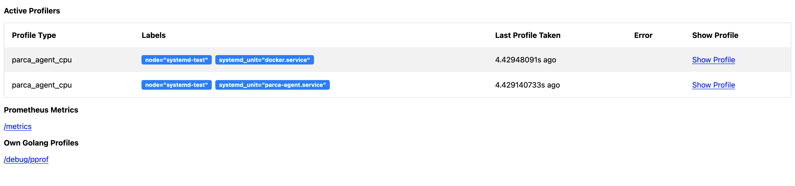

# Profiling systemd

import WithVersions from '@site/src/components/WithVersions';
import CodeBlock from '@theme/CodeBlock';
import BrowserWindow from '@site/src/components/BrowserWindow';

:::tip

You can learn about [how to run the Parca Agent binary](/docs/agent-binary); if you haven't already.

:::

:::caution

To specify which service discovery to use for the Parca Agent, we use the following flags:

```shell
      --kubernetes              Discover containers running on this node to
                                profile automatically.
      --systemd-units=SYSTEMD-UNITS,...
                                systemd units to profile on this node.
```

By default, the Agent uses Kubernetes service discovery. So we need to disable it:

```diff
parca-agent \
  --http-address=":7071" \
  --node=systemd-test \
+  --kubernetes=false \
  --insecure
```
:::

### Profiling additional units

To profile units, you just need to specify the name of the service in `--systemd-units` flag.
```diff
parca-agent \
  --http-address=":7071" \
  --node=systemd-test \
+  --systemd-units=docker.service,my-app.service \
  --kubernetes=false \
  --insecure
```

Now we can view the active profilers by visiting `http://localhost:7071`:
 <BrowserWindow>

 

 </BrowserWindow>
