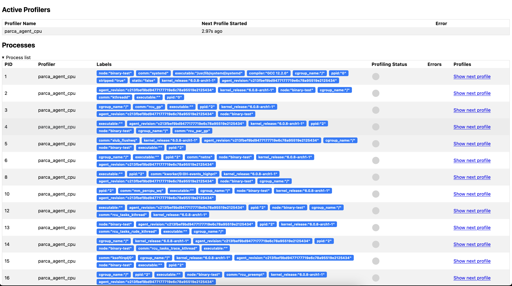

import BrowserWindow from '@site/src/components/BrowserWindow';

# Troubleshooting Parca Agent

## Web UI

The HTTP endpoints can be used to inspect the active profilers by visiting port `7071` of the process (the host-port that the agent binds to can be configured using the `--http-address` flag).

For example, that might look like the following:

<BrowserWindow>

</BrowserWindow>

And all the discovered processes:
<BrowserWindow>

</BrowserWindow>

And by clicking "Show next profile" in one of the rows, the currently collected profile will be rendered once the collection finishes (this can take up to 10 seconds).

<BrowserWindow>

</BrowserWindow>

A raw profile can also be downloaded here by clicking "Download Pprof". Note that in the case of native stack traces such as produced from a compiled language like C, C++, Go, Rust, etc., are not symbolized, and if this pprof profile is analyzed using the standard pprof tooling, the symbols will need to be available to the tooling.

## Logging

To debug potential errors, enable the debug logging using `--log-level=debug`.

To reach out to eBPF program logs use `bpftool prog tracelog`. You could also find the following document useful for further troubleshooting techniques using `bpftool`: [https://qmonnet.github.io/whirl-offload/2021/09/23/bpftool-features-thread](https://qmonnet.github.io/whirl-offload/2021/09/23/bpftool-features-thread/)
